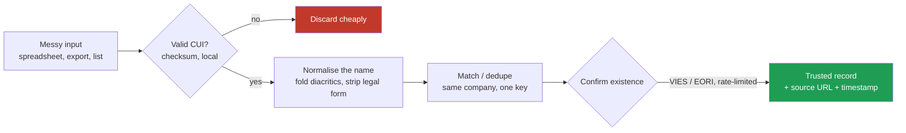

# Romanian Open Company Data

A practical, dependency free Python toolkit and field guide for working with
Romania's public company data.

Romania publishes a surprising amount about its roughly 1.7 million
registered legal entities: identifiers, activity codes, annual financial
statements, VAT status, insolvency notices, public procurement awards. The
data is genuinely open. It is also scattered across a dozen institutions, in
inconsistent formats, with undocumented conventions that will quietly corrupt
your analysis if you do not know about them.

This repository is what I wish had existed before I spent several years
learning it the hard way. It is two things:

1. **A field guide** to the registers: what each one publishes, what it is
   actually good for, and where it will mislead you.
2. **A small library** of the primitives you need in the first hour of any
   project: identifier validation, name normalisation for joining, activity
   code handling, and polite clients for the official EU verification
   services.

```python
from rocompany import caen, cui, names

cui.is_valid("RO 4382 5150")            # True, messy formatting is fine
cui.parse(43825150).vat                 # 'RO43825150'

names.normalise("S.C. ALFA COM S.R.L.") # 'ALFA COM'
names.normalise("ALFA-COM SOCIETATE COMERCIALA CU RASPUNDERE LIMITATA")
                                        # 'ALFA COM', the same company

caen.parse(4941).section_label          # 'Transportation and storage'
```


## The join problem, in one picture

Two Romanian datasets rarely join cleanly. This is the pipeline the library is
built for: throw away rubbish cheaply, normalise the survivors, then confirm
against an official source before trusting anything.



The green box is the only state you should act on. The checksum filter is fast
but not proof, so nothing is trusted until an official source confirms it.

## Why this is harder than it looks

Four problems account for most of the pain.

**The identifier looks simple and is not.** The CUI (fiscal code) carries a
check digit, which lets you discard most rubbish locally before spending a
network call. But passing the checksum is necessary, not sufficient: roughly
one arbitrary number in eleven passes by coincidence. The Romanian postcode
`010101` validates perfectly and is not a company. Treat local validation as
a cheap filter, never as proof of existence.

**Company names do not join.** The same company appears as `S.C. ALFA COM
S.R.L.`, `ALFA COM SRL`, `Alfa Com S.R.L.` and `ALFA-COM SOCIETATE COMERCIALA
CU RASPUNDERE LIMITATA`. Strip the ornamental `S.C.` prefix and the legal
form, fold the punctuation, and they collapse to one key. Keep the legal form
as a separate field though: `ALFA COM SRL` and `ALFA COM SA` are two
different legal entities that happen to share a trading name, and merging
them is a real error with real consequences.

**The diacritic trap.** Romanian writes s and t with a comma below (U+0219,
U+021B). For years software shipped the Turkish cedilla look alikes (U+015F,
U+0163) instead, because early code pages did not distinguish them. Public
registers contain both, sometimes in the same file. A matcher that folds only
one of the two pairs will silently miss matches and you will never see an
error message. This library folds both.

**Declared data is declared, not observed.** The principal activity code
describes what the company registered to do, often years ago. Companies
almost never update it. It is a strong prior and a terrible ground truth.
Cross check it against revenue, headcount and the company's own website
before you build anything on top of it.

## The registers, and what each is good for

| Source | Publishes | Good for | Watch out for |
| --- | --- | --- | --- |
| **ONRC** (trade register) | Incorporation, legal form, registered office, administrators, status | The authoritative existence check, company officers | Ownership and shareholding are generally not in the free open data |
| **ANAF** (tax authority) | VAT registration, VAT on collection, inactive taxpayer list, annual financial statements | Revenue, profit, headcount, fiscal standing | Financial statements lag by up to a year, and micro entities file a reduced set |
| **data.gov.ro** | Bulk CSV extracts of several of the above | Getting a whole population at once instead of scraping | Files are republished irregularly and schemas drift between editions |
| **VIES** (EU) | Whether a VAT number is valid right now, sometimes the name and address | Confirming a trading partner before zero rating a supply | An invalid answer usually just means the company is not VAT registered |
| **EORI / EC DDS2** (EU) | Whether a customs registration is valid, details if the operator consented | The cleanest public signal that a small company trades across the customs border | Missing name means the operator did not consent to publication, not a data error |
| **SEAP / SICAP** | Public procurement notices and awards | Who sells to the state, contract values, buying institutions | Buyer names are free text and need normalising before they will join |
| **BPI** (insolvency bulletin) | Insolvency, reorganisation, bankruptcy notices | Credit risk, and a timing signal | Publication lags the court decision |
| **Monitorul Oficial** | Statutory announcements | Corporate events you will not find elsewhere | Unstructured text, expensive to parse |

Two principles worth stating plainly, because they are what separates a
pipeline you can defend from one you cannot.

**Use primary sources.** Everything above is published by the institution
that creates the data. Commercial aggregators repackage it, and their terms
of use generally forbid redistribution. Going to the source is cheaper, more
current, and legally clean.

**Record provenance on every derived record.** Store the source URL and the
retrieval timestamp alongside the value, always. It costs two columns. It is
what lets you answer "where did this come from and when", which you will be
asked, by an auditor, a customer, or your future self debugging a number that
looks wrong.

## The library

| Module | What it does |
| --- | --- |
| `rocompany.cui` | Validate, normalise and format Romanian fiscal codes |
| `rocompany.names` | Normalise and match company names, including the diacritic and legal form traps |
| `rocompany.caen` | Activity codes: sections, parsing, loading the official labels |
| `rocompany.iban` | IBAN validation with the Romanian specifics |
| `rocompany.vies` | Polite client for the EU VAT validation service |
| `rocompany.eori` | Polite client for the EU customs registration validator |
| `rocompany.throttle` | The rate limiting and backoff both clients use |

### On calling the official services

The VIES and EORI endpoints are free, public, and maintained by tax
authorities for one at a time verification. They are not a bulk data source.

Both clients in this repository enforce a minimum interval between requests,
add jitter, back off exponentially on 429 and 5xx, and give up rather than
retry forever. That is deliberate and you should not remove it. If you need
ten thousand checks, run them over days, cache every result with its
timestamp, and re validate on a TTL instead of on every pipeline run. A valid
registration changes rarely, so a quarterly refresh is usually plenty.

A service error is not a negative answer. Store "unknown" and retry later.
Recording a timeout as "invalid" is how you end up deleting real customers
from your database.

## Install and run

```bash
git clone https://github.com/<user>/romanian-open-company-data
cd romanian-open-company-data
python -m pytest tests -q          # 47 tests, no network required
python examples/clean_a_messy_list.py
python examples/verify_live.py     # this one does call the EU services
```

No dependencies beyond the standard library. Python 3.11 or newer.

## Scope, and what is deliberately not here

This is a library of primitives and a guide to public sources. It does not
scrape anything, it ships no company data, and it contains no scraper for any
commercial website.

If you are building on Romanian company data for commercial outreach, the
identifier handling is the easy part. The part that will actually decide
whether your project survives is lawfulness: legal basis, provenance,
suppression, retention, and the transparency obligation that applies when you
collect data about people from somewhere other than those people. That is a
separate subject and it deserves more than a paragraph here.

## Licence

MIT. See [LICENSE](LICENSE).

Not affiliated with, or endorsed by, any of the institutions listed above.
