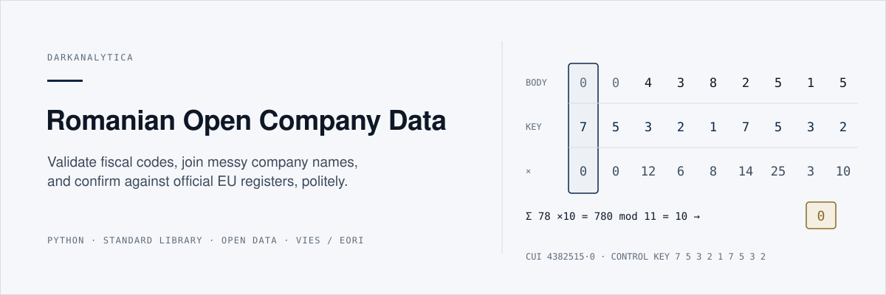
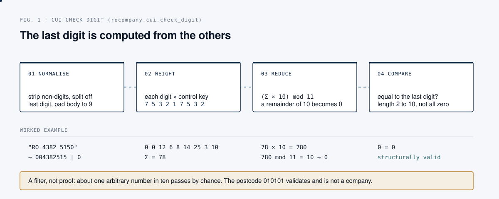
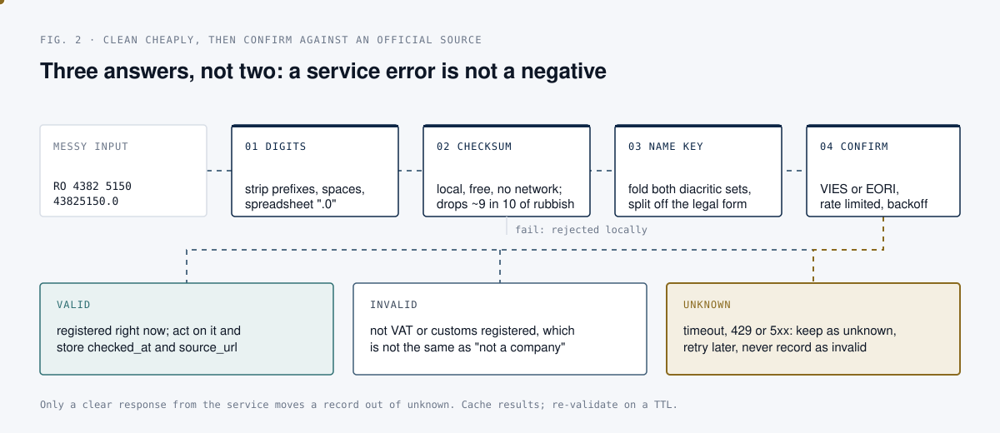

<p align="center">
  
</p>

<p align="center">
  <a href="https://github.com/darkanalytica1/romanian-open-company-data/actions/workflows/tests.yml"></a>
  
  
  
</p>

# Romanian Open Company Data

## What this is

A field guide and a small, dependency-free Python library for working with
Romania's public company data. The guide explains what each official register
publishes, what it is good for, and where it will mislead you. The library
covers the primitives you need in the first hour of any project: fiscal code
(CUI) validation, company-name normalisation for joins, activity-code (CAEN)
handling, IBAN checks, and rate-limited clients for the official EU VIES and
EORI validators.

```python
from rocompany import caen, cui, names

cui.is_valid("RO 4382 5150")            # True, messy formatting is fine
cui.parse(43825150).vat                 # 'RO43825150'

names.normalise("S.C. ALFA COM S.R.L.") # 'ALFA COM'
names.normalise("ALFA-COM SOCIETATE COMERCIALA CU RASPUNDERE LIMITATA")
                                        # 'ALFA COM', the same company

caen.parse(4941).section_label          # 'Transportation and storage'
```

## Why it matters

Romanian company data is genuinely open: identifiers, activity codes, annual
financial statements, VAT status, insolvency notices and procurement awards
are all published. It is also scattered across a dozen institutions, in
inconsistent formats, with undocumented conventions that corrupt an analysis
without raising a single error. Supplier due diligence, market mapping,
counterparty checks and open-source research on companies all start with the
same question: is this the entity I think it is, and can I prove where that
answer came from? This repository makes that step cheap, repeatable and
defensible.

## How it works

The check digit lets you discard most rubbish locally, before spending a
network call.

<p align="center">
  
</p>

Survivors are joined on a normalised name key, then confirmed against an
official source. The answer has three states, not two.

<p align="center">
  
</p>

## Quick start

Python 3.11 or newer. The library uses only the standard library; `pytest` is
needed only for the tests.

```bash
git clone https://github.com/darkanalytica1/romanian-open-company-data
cd romanian-open-company-data
python3.11 -m venv .venv && source .venv/bin/activate
pip install -r requirements-dev.txt

python -m pytest -q                    # 47 tests, no network required
python examples/clean_a_messy_list.py  # offline: clean and join a messy list
python examples/verify_live.py         # calls the EU VIES and EORI services
```

`clean_a_messy_list.py` prints a table like this, then a summary of what the
cleaning bought (duplicate rows collapsed, an insolvency suffix flagged, the
impossible activity code `3400` rejected, rows with no usable identifier set
aside):

```
      input id  valid  name core               form   caen   section
------------------------------------------------------------------------------
  RO 4382 5150  True   ALFA COM                SRL    4941   H
    43825150.0  True   ALFA COM                SRL    4941   H
      14162177  True   TESATORIA SERBAN        SA     1310   C
  0722 123 456  False  BETA TRANS              SRL    4941   H
```

`verify_live.py` makes a handful of rate-limited requests. Keep it that way:
these endpoints are a public service for one-at-a-time verification, not a
bulk feed.

## Method

Four problems account for most of the pain, and each module exists to handle
one of them.

**The identifier looks simple and is not.** The CUI carries a check digit
computed with the control key `7 5 3 2 1 7 5 3 2` (Figure 1). Passing the
checksum is necessary, not sufficient. Because a remainder of 10 is mapped to
0, a random last digit matches about one time in ten, so roughly one arbitrary
number in ten passes by coincidence (a quick simulation over random 6, 8 and
10 digit numbers gives 10.0 to 10.1 percent). The postcode `010101` validates
and is not a company. Treat local validation as a filter, never as proof of
existence.

**Company names do not join.** The same company appears as `S.C. ALFA COM
S.R.L.`, `ALFA COM SRL`, `Alfa Com S.R.L.` and `ALFA-COM SOCIETATE COMERCIALA
CU RASPUNDERE LIMITATA`. Strip the ornamental `S.C.` prefix and the legal form,
fold the punctuation, and they collapse to one key. Keep the legal form as a
separate field: `ALFA COM SRL` and `ALFA COM SA` are two different legal
entities, and merging them is a real error.

**The diacritic trap.** Romanian writes s and t with a comma below (U+0219,
U+021B). For years software shipped the cedilla look-alikes (U+015F, U+0163)
instead, and public registers contain both, sometimes in the same file. A
matcher that folds only one pair silently misses matches. This library folds
both.

**Declared data is declared, not observed.** The principal activity code
describes what the company registered to do, often years ago, and is rarely
updated. It is a strong prior and a poor ground truth. Cross-check it against
revenue, headcount and the company's own website.

### The registers, and what each is good for

| Source | Publishes | Good for | Watch out for |
| --- | --- | --- | --- |
| **ONRC** (trade register) | Incorporation, legal form, registered office, administrators, status | The authoritative existence check, company officers | Ownership and shareholding are generally not in the free open data |
| **ANAF** (tax authority) | VAT registration, VAT on collection, inactive taxpayer list, annual financial statements | Revenue, profit, headcount, fiscal standing | Statements lag by a year or more, and micro entities file a reduced set |
| **data.gov.ro** | Bulk CSV extracts of several of the above | A whole population at once instead of many requests | Republished irregularly; schemas drift between editions |
| **VIES** (EU) | Whether a VAT number is valid right now, sometimes name and address | Confirming a trading partner before zero-rating a supply | Invalid usually just means not VAT registered |
| **EORI / EC DDS2** (EU) | Whether a customs registration is valid, details if the operator consented | A clean public signal that a company trades across the customs border | A missing name means no consent to publication, not a data error |
| **SEAP / SICAP** | Public procurement notices and awards | Who sells to the state, contract values, buying institutions | Buyer names are free text and need normalising |
| **BPI** (insolvency bulletin) | Insolvency, reorganisation, bankruptcy notices | Credit risk, and a timing signal | Publication lags the court decision |
| **Monitorul Oficial** | Statutory announcements | Corporate events not found elsewhere | Unstructured text, expensive to parse |

Two principles separate a pipeline you can defend from one you cannot.
**Use primary sources:** everything above is published by the institution that
creates the data; aggregators repackage it under terms that generally forbid
redistribution. **Record provenance on every derived record:** store the source
URL and retrieval timestamp beside the value. It costs two columns and answers
the question an auditor, a customer or your future self will ask.

### The library

| Module | What it does |
| --- | --- |
| `rocompany.cui` | Validate, normalise and format Romanian fiscal codes |
| `rocompany.names` | Normalise and match company names, including the diacritic and legal-form traps |
| `rocompany.caen` | Activity codes: sections, parsing, rejecting codes that fall in nomenclature gaps |
| `rocompany.iban` | IBAN validation with the Romanian specifics |
| `rocompany.vies` | Polite client for the EU VAT validation service |
| `rocompany.eori` | Polite client for the EU customs registration validator |
| `rocompany.throttle` | The rate limiting and backoff both clients use |

Both clients enforce a minimum interval between requests, add jitter, back off
exponentially on 429 and 5xx, and give up rather than retry forever. A service
error is returned as `valid=None` (unknown), never as invalid. For large lists,
run checks over days, cache every result with its timestamp, and re-validate on
a TTL: registration status changes rarely.

Further reading in this repository: [docs/SOURCES.md](docs/SOURCES.md), a
register-by-register guide, and [docs/GOTCHAS.md](docs/GOTCHAS.md), ten
failure modes that produce no error message.

## Limitations and assumptions

- Local validation is structural only. A valid CUI checksum does not prove a
  company exists; confirm against a register.
- VIES answers "registered for intra-community VAT right now", not "exists" or
  "is trading". EORI answers "registered for customs", not "is shipping".
- The live clients depend on EU services that go down and may change their
  interfaces. The test suite deliberately does not call them; the offline tests
  cover parsing and normalisation only.
- CAEN labels and nomenclature boundaries are revised over time. Section
  boundaries are encoded in code; refresh labels from the official source.
- The name normaliser targets Romanian legal forms and diacritics. It is a join
  key, not an identity decision: require a second signal (a shared CUI or
  registration number) before merging records.
- No company data is shipped, nothing is scraped, and there is no client for any
  commercial data website. If you use this for outreach, the identifier handling
  is the easy part; lawful basis, provenance, suppression and retention are the
  hard part and are out of scope here.

## Sources

- ANAF, fiscal code control key and VAT registers: <https://www.anaf.ro/>
- ONRC, National Trade Register Office: <https://www.onrc.ro/>
- Romanian open data portal: <https://data.gov.ro/>
- European Commission, VIES VAT number validation: <https://ec.europa.eu/taxation_customs/vies/>
- European Commission, EORI number validation: <https://ec.europa.eu/taxation_customs/dds2/eos/eori_home.jsp>
- Eurostat, NACE Rev. 2 statistical classification (basis of CAEN Rev. 2)
- Unicode, U+0218 to U+021B (Latin letters with comma below)

## License

MIT. See [LICENSE](LICENSE). Not affiliated with, or endorsed by, any of the
institutions listed above.
